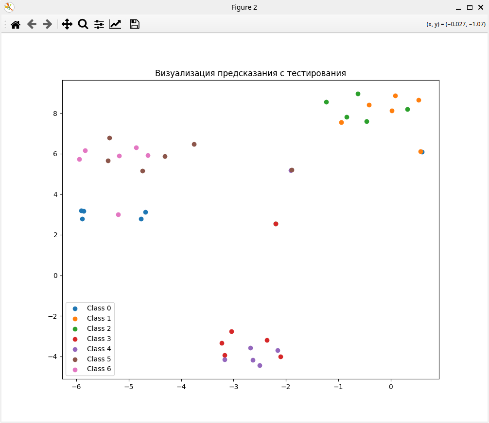
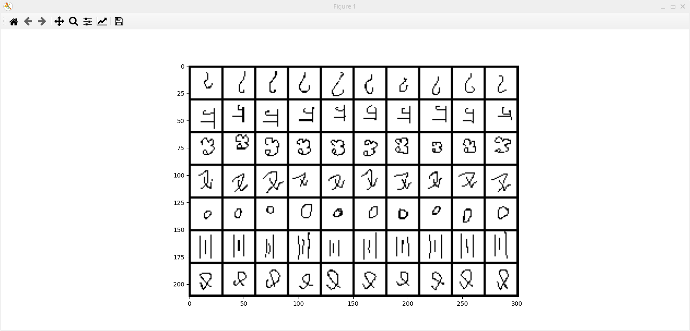

# Отчет

Команда:
- Диниулов Расим Б03-212
    - реализация функции чтения данных
    - task 6
- Русанов Антон Б03-212
    - логирование в процессе обучения 
    - функция для визуализации предсказания с тестирования
- Майорова Ева Б03-213
    - энкодер на основе сверточной нейроннй сети
    - Prototypical Networks

Обученные модели тут: 
 - https://disk.360.yandex.ru/d/7dmtlbwku_tuhQ

Отчеты:
 - [https://wandb.ai/ch2/hw4/reports/Untitled-Report--VmlldzoxMzAzOTk5MA?accessToken=9l8oxulpdvw7klr3qb0kvcccon43gskzbgkkng4vmt873ui3xwlgxv5lr7exq5xo](https://wandb.ai/ch2/hw4/reports/Untitled-Report--VmlldzoxMzA0NjI3Ng?accessToken=zhzwosdvuxjujvlii736w1k78bgegyptl60zu27p3eq1kt4s0hhijftt4o34rkgu)

 Визуализация:
 
 

 